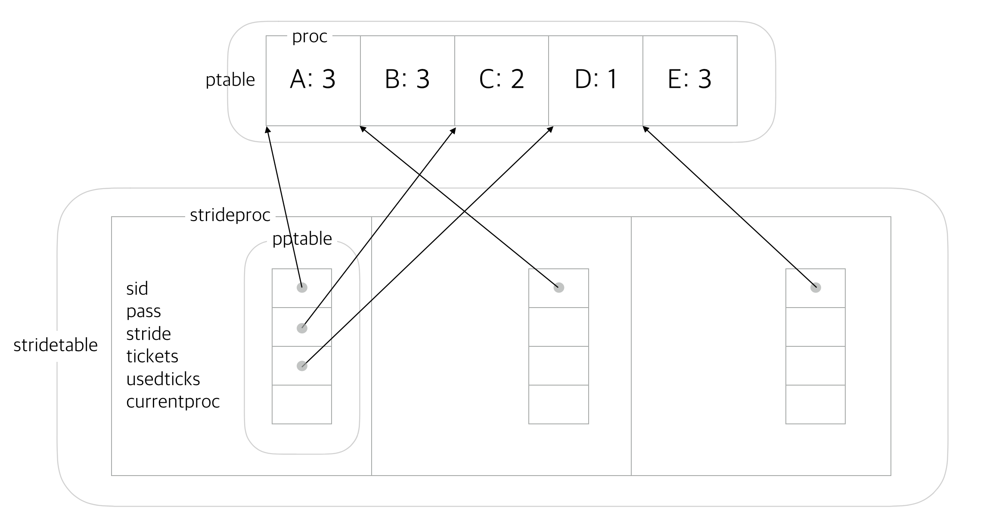
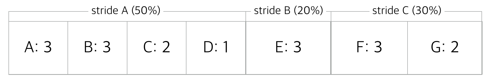
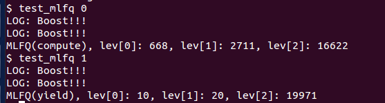
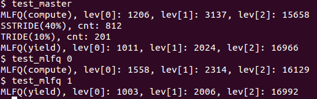

# MLFQ + Stride Scheduler

Here is the big picture of combinated scheduler.

### Fingure 1. structs



### Figure 2. time line



<br>

## 1. Structure of scheduler

### 1.1 `ptable`

`ptable` is the table which will save all the **real** `proc` structs. All the processes information will save in this Array.

```c
struct {
  struct spinlock lock;
  struct proc proc[NPROC];	// array of proc struct
} ptable;	// unique table
```

We have all the processes here, so we can get benefit to manage processes. For example we could easily find child process from this table when parent exit before child exit and change child's parent to `initproc`.

<br>

### 1.2 `stridetable`

`stridetable` is the table which will save all the `strideproc` structs. This table will be managed by stride scheduler.

```c
struct {
  struct spinlock lock;
  struct strideproc strideproc[NPROC];	// array of strideproc struct
} stridetable;	// unique table
```

<br>

### 1.3 `strideproc`

`strideproc` is struct for stride process. In this process, we have all the information to run stride scheduler, like stride and pass.

> As we think that MLFQ is one of the stride process, further more in my design, all the stride process has MLFQ inside. If one of the stride process make child process, then parent and child process will run like MLFQ inside the stride scheduler. You can see in [Figure 2](#figure-2-time-line).
> 
> In [Figure 2](#figure-2-time-line), Stride A is MLFQ where shell program is running. Stride B and C is made by [`set_cpu_share()`](#23`set_cpu_share()`). Inside Stride C, there are two processes, one is parent and the other is child process.

```c
struct strideproc {
  struct spinlock lock;
  struct pptrtable pptable;		// pptable will save pointer of procs in ptable
  int tickets;
  int stride;
  int pass;
  int usedticks;	// save usedticks for boosting
  int sid;			// stride proc id
  int currentproc;	// index of running proc in pptable
}
```

In `pptable` we will save **pointer** of real proc in `ptable`. Then, we could get list of processes which are running in each stride process. If we execute `set_cpu_share()` , it will pop pointer from MLFQ stride and push it to new stride proc. See in [Figure 1](#figure-1-structs).

<br>

### 1.4 `pptrtable`

Table struct to save pointer of procs.

```c
struct pptrtable {	// proc pointer table
  struct spinlock lock;
  struct proc *proc[NPROC];		// array of proc pointers
}
```

<br>

### 1.5 `proc`

`proc` is struct for process. In this struct, it has all the informations to run in OS.
I added some information for MLFQ scheduler

```c
struct proc {
	~~
	// Info for MLFQ
	int level;		// Priority Queue Level (0, 1, 2)
	int usedticks;	// Ticks it used in this quantum
};
```

> Managing three ques make code tricky, so we can just save priority information in each process and use one list which save all the processes. We could just pick higher priority process while rounding this list. (while checking is it `RUNNABLE` state). we could save priority info in `proc` structure which is listed in `pptable`. (higher number is higher priority). This will work as same as queues. This will be explained detail at [3. MLFQ scheduler](#3-mlfq-scheduler).


<br>
<br>


### Figure 3. MLFQ + Stride


* 10ms (1tick) take for one step.

<br>

## 2. Stride scheduler

### 2.1 stride scheduler work flow

1. Find strideproc which has the smallest pass.
2. Change `current` to found strideproc.
3. If `current` strideproc's `pptable` is empty, remove strideproc.
4. If `current` strideproc's `pptable` is not empty, start MLFQ_scheduler().

<br>

### 2.2 `current`

> What `current` is use for?
>
> `current` is used to get current strideproc. 
>
> It is used in `allocproc()` which is function when assign new process. Inside `allocproc()`, it first save new process in `ptable` and save new process's pointer in `pptable` in `current`.
>
> It is also used in `MLFQ_scheduler()` . Inside `MLFQ_scheduler()`, `current->pptable` will get list of proc pointers which are assigned in current stride process.

<br>

### 2.3 `set_cpu_share()`

`set_cpu_share` is system call to change process in mlfq to stride.

1. If this request will make MLFQ's cpu share less than 20% -> print error and do nothing.
2. Find room for new stride proc. -> if there is no room, print error and do nothing.
3. Assign new stride proc and move proc pointer from MLFQ to new stride proc.

    > new stride proc's pass will set to `minimum pass of stridelist - stride`.
    >
    > This let new process be scheduled at first time, so it will get good response time. It also prevent monopolizing CPU. And it does not initialize all the passes so it maintains the flow of the strides, like naturally melting in.
    
4. Change MLFQ's tickets and stride.
5. Process will run in new stride proc after it return cpu after this system call.

<br>

## 3. MLFQ scheduler

### 3.1 mlfq scheduler work flow

1. If process doesn't use all of its quantum yet -> run again.
2. if process use all of its quantum, then level down and set usedticks to 0.
3. Find process to run next.
    1. Start to find index of currentproc+1.(with highest priority level).
    2. Look around all the index of array with highest priority level.
    
        > this will double check currentproc+1 to endOfIndex, but it's not a big deal. It make code simple so I just ignore it.
        
    3. Look around all the index of array with 1 level lower than before.
4. If there is no process to run, then just add 1 (because actually it doesn't use but it also wasted time to find runnable process) to its pass and return MLFQ_scheduler to find another stride proc to run.
5. if there is process to run, switch to it.


> In this design, I don't use **real** queue. But by the 3.1.3 process(and also 3.1.2), it just work like queue.
>
> If we use flexable queue, we have to waste resource(time) for malloc.
>
> If we use nonflexable queue, then we have to waste memory for three big array(because we don't know that all the processes might use the highest level queue, so all the queue must have NPROC size of array)
>
> And also queue make tricky to find processes Childs and something jobs to look around all the processes.
>
> Use one array to manipulate all the processes give alot of benefits to us.

<br>

### 3.2 boosting

When process `yield()` or `sleep()` (By timer interrupt, yield syscall, I/O) it will enter `sched()` function. Inside `sched()`

1. `proc->usedticks++` increase used ticks of process. -> to manage priority level with quantum.
2. `current->usedticks++` increase used ticks of stride process. -> to manage boost.
3. `current->pass += current->stride` increase pass of stride process.
4. If `current->usedticks` over 100, boost.

Inside `boost()` function, it will set the highest level to all the **procs in `current` stride proc**.

> ### CAUTION: This boosting system is not completely FAIR.
> Let's think about "test_mlfq" process which yield frequently. Although this process yield before timer interrupt, its `usedticks` will be increased. This is not fair because it didn't use complete 1 tick and also increase `current->usedticks` will make MLFQ boost faster than normal(100*10ms). 
> 
> Is there any solution?
> 
> At previous case, we added more ticks than what MLFQ actually use.
> We could add `current->usedticks` only when timer interrupt yield. BUT, in this case we will add less ticks than what MLFQ actually use. Process's `usedticks` is still added more ticks than it actually use. This lead process's priority level decrease faster so it can't use enough cpu-time at high priority level. Like this
> 
> 
> 
> Both method have error, so I just remain my code at previous case. It boosts more than normal, but it give more chance to mlfq_yield process to run at high priority queue. This result looks like reasonable.
> 
> 

<br>

## 4. Life of process

### 4.1  `pinit()` 

1. Initialize locks of structs.
2. Init first stride proc (MLFQ).

<br>

### 4.2 `allocproc()`

1. Find unused proc from `ptable` and initialize it.

    > `p->level = 0` (set to the highest level), `p->usedticks = 0` set usedticks to 0.

2. Find unused proc pointer from `pptable` and save pointer of proc.

<br>

### 4.3 `scheduler()`

[See 2.1 stride scheduler workflow](#21-stride-scheduler-work-flow)

<br>

### 4.4 `MLFQ_scheduler()`

[See 3.1 mlfq scheduler workflow](#31-mlfq-scheduler-work-flow)

<br>

### 4.5 return CPU

There are three way process return CPU.

1. By timer interrupt. In `trap()` process will `yield()`
2. By system call. `yield()`
3. By I/O. `sleep()`

All of these three way will call `sched()` function to enter scheduler.

<br>

### 4.6 `sched()`

[See 3.2 boosting](#32-boosting)

<br>

### 4.7 `set_cpu_share()`

[See 2.3 set\_cpu\_share()](#23set_cpu_share())

<br>

### 4.8 `exit()` and `wait()` from parent

When process exit, then its state change to `ZOMBIE`. Later, when parent `wait()` execute, this process will be deleted from `ptable` and also `pptable`.