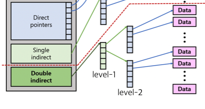

# Proj. 4 File System


This project's goal is to **expand the maximum size of a file**. In the structure of file system, inode have a list of data block's address. It could have direct pointers to data block or could also have indirect block which points to block which save pointers to data block. In our xv6, it already have single indirect pointer. let's calculate.

```c
#define BSIZE 512
#define NDIRECT 12

(12 * 512) by 12 direct pointers
(1 * 512/4 * 512) by single indirect pointer
  
(12 * 512) + (1 * 512/4 * 512) = 6144 + 65536 = 71680 byte = 70 MB
```

This is what original xv6's maximum file data size.

Then let's calculate how it change if we use double indirect.

```c
#define BSIZE 512
#define NDIRECT 11 // reduce 1 to set double indirect (to maintain same size of inode)

(11 * 512) by 11 direct pointers
(1 * 512/4 * 512) by single indirect pointer
(1 * 512/4 * 512/4 * 512) by single double indirect pointer

71680 + 8388608 = 8460288 byte = 8262 MB = almost 8 GB
```

We could save 118 times more data by this.

Then, how could we make **double indirect pointer** in inode?


## 1. Modify structure for double indirect

In ```struct dinode```, we could save 13 pointers. We need to assign one for double indirect, we will reduce one of direct pointer.

In `fs.h`

```c
#define NDIRECT 11
#define NINDIRECT (BSIZE / sizeof(uint))
#define NDOUBLEINDIRECT (NINDIRECT * NINDIRECT)
#define MAXFILE (NDIRECT + NINDIRECT + NDOUBLEINDIRECT)
```

Each constants indicate how many blocks it could point.


## 2. bmap

`bmap` is the function which assign data block and save pointer to inode structure. If we change this function to serve double indirect, then there would be no problem to save data by double indirect.

`bmap` is calling in sequentially, so it just assign one block. Check is block number affordable, then assign data block.

Here is the **Work flow**

1. check is that block number is affordable.
2. If there is no level-1 table, assign it.
3. If we divide block number with `NINDIRECT`, then we could get which level-1 entry should it be saved. If there is no level-2 table, assign it.
4. If we modulo block number with `NINDIRECT`, then we could get which level-2 entry should it be saved. Assign data block to it.




## 3. itrunc

This function is called when inode should discard (If there is no link to this inode). Inside this, it should free all data blocks it holds. Before, xv6 just clear direct and indirect ed blocks. So we should change `itrunc` to serve double indirect.

Here is the **Work flow**

1. check is Double indirect points to data block (level-1 table).

2. Loop: check is indirect points to data block (level-2 table).

   > 1. Loop: check is direct points to data block which save real data.
   > 2. Free the data block.
   > 3. also free data block which save table.

3. free data block which save level-1 table.

