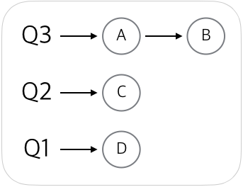
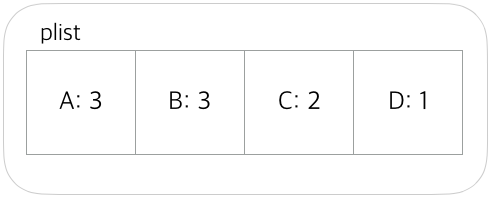
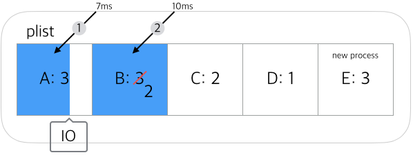
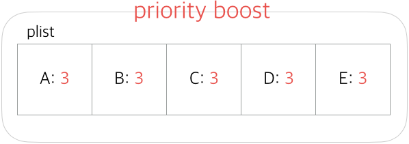
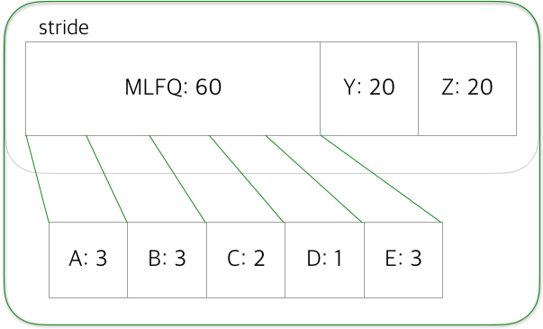
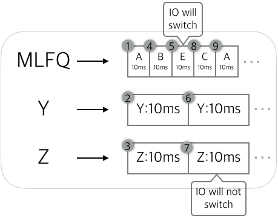

# MLFQ and Stride scheduling

<br>

## MLFQ

### 3-Level feedback que

> To make 3-level feedback que, at first we need to think about three ques where processes will be saved by priority. Q3 is the highest priority que and Q1 is the lowest one. Processes in Q3 will be scheduled first and if A and B process are not in `RUNNABLE` state, then process in Q2 will be scheduled and so on. 



<br>

> But managing three ques make code tricky, so we can just save priority information in each process and use one list which save all the processes. We could just pick higher priority process while rounding this list. (while checking is it `RUNNABLE` state). we could save priority info in `proc` structure which is listed in `plist`. (higher number is higher priority). This will work as same as upper one.



<br>

### How this work

> 1. If new process enters in the list, it gets level 3 (highest priority). 
> 
> 2. We will measure whether this process works for whole time block or not(10ms: our xv6's timer interrupts every 10ms). If this process go `sleep`(IO request or et cetera) before `yield`(timer interrupt), it's priority will be remained. But if it just `yield` by timer, then it's priority level will decrease. (I'm not sure what method to use for measuring time. I tested intel x86 `rdtsc` instruction to measure accurate time, but not sure about it. I could just use `ticks` in `trap.c`)(If I can measure specific time, I could prevent gamed-scheduler)
> 
>     **In my design, I want to make process works for highest priority at first several times to make user feel this machine response fast. But I think it needs test that this idea make good response time for user.*
> 
>     
> 
> 3. Processes which have same priority level will scheduled by **Round Robin**.
> 
>    - level 3 will use 10ms time quantum.  
>    - level 2 will use 20ms time quantum.  
>    - level 1 will use 40ms time quantum.  
> 
>     But notice that if level 3 process turns into `RUNNABLE` state while level 1 process is running, then level 1 process will be descheduled at next timer interrupt and level 3 process will be scheduled.
> 
> 4. Until now we just remain or decrease priority level, but may be some process work with IO after they get lowest priority and if there is a lot of processes which have highest priority, then lower priotity processes can't be scheduled. So now we have to use *priority boost* to solve this problem. We will boost priority every specific seconds (boost time will be changed to efficient time which is proportional to number of process). After they all get highest priority, they will measure again, and will be scheduled at least one time so it could prevent starvation.  
> 
>     
>

<br>

## Combine the stride scheduling algorithm with MLFQ

### Why we use stride with MLFQ?

> MLFQ is pretty good algorithm for many user, but what if you want to manipulate the importance of the jobs?  
> This is really needed feature for expert user who need extreme performance for a specific program.

<br>

### MLFQ inside stride scheduler

> We will treat MLFQ like sigle process which is running in stride scheduler.  
> In stride scheduler, Y and Z processes are using specific amount of cpu time what we ordered and the other time will be assigned to MLFQ. At that time, MLFQ just works like as it is (like explain above). 
 


> To distinguish processes, we will put stride processes in another list (will call `stridelist`). Each stride processes will get special amount of tickets (total 100 of tickets). This will represent their portion of cpu time. MLFQ will get the rest of tickets and it sould be more than 20.  
> In the program, or use special program to manage stride scheduler, we will use **SYSTEM CALL** to  requests the portion of cpu. It will make error if the request will make portion of MLFQ less than 20%.  

> ---

> **SYSTEM CALL** will work like this.
> 
>	1. pop the process form the MLFQ(`plist`).
>	2. push the process into `stridelist` with tickets.
>	3. save it's pass as `minimum pass of stridelist - stride`
>	4. change MLFQ's tickets.
>	5. make error if the request make MLFQ portion less than 20%.
>
> Why we save pass as `minimum pass of stridelist - stride`?  
> This let new process be scheduled at first time, so it will get good response time. It also prevent monopolizing CPU. And it does not initialize all the passes so it maintains the flow of the strides, like naturally melting in.
>
> This is pretty easy syscall which looks like wouldn't work well, but scheduler will work different for two list(`plist` and `stridelist`) so it will work well.
> 
> *we also have opposite system call which will pop process from `stridelist` and push to `plist`
> 
> ---

<br>

### How this combination scheduler work

> Let's look stride first. We will give total 100 tickets for stride processes and MLFQ. This will divide portion of each processes.  
> we can calculate each strides like this
> 
> ``` stride = 100 / number of tickets ```
> 
> number of tickets will save in `stridelist` like this
> 
> ```c
> struct stride_process {
>     uint tickets;
>     double stride = 100 / (double)tickets;
>     double pass;
>     struct proc *plist[];	// why use list? this will explain at the end.
> }
> struct stride_process stridelist[81];	// 81 is max number of stride(include MLFQ)
> ```
> 
> In the `stridelist`, we will pick up process(or MLFQ) which has smallest pass. Then schedule it and add `stride` to it's `pass`. This just looks like normal stride scheduler.  
> 
> *When executing stride process, it will not switch to other process until it ends it's portion(it will not giveup cpu while waiting IO, et cetera)(By professors Jung's words: It should be accurate when it's related to money (like VMWare machine))
> 
> ---
> 
> But it would work different when it's time to schedule MLFQ. 
> When it's portion is for MLFQ, MLFQ will work like just it is. But at outside it works like stride process. MLFQ will assign at `stridelist[0]` and `pass` will be added after it went ahead of `stride`. MLFQ's `tickets` will automatically calculated when the other process assigned to `stridelist` or deleted from `stridelist`.
> 
> 
> 
> *In MLFQ, processes will not switch to stride processes when it's IO request. It just switch to processes in MLFQ.
>
> *As mentioned above, if new process entered in stride system, it just took MLFQ's tickets not if it make MLFQ's tickets less than 20.
> 
> ---
> 
> There is one more problem left. What if stride process make child process?  
> We will just share the time space which parent assigned and parent・child will run with **Round Robin** algorithm inside that portion. Then we could just save processes in `struct proc *plist[]` with same priority level. This will work with same code with MLFQ.  
> 
> *inside of stride process, it could switch(By IO or something) to parent or child or other child. But it can't switch to another stride process.


<br>
<br><br><br><br><br><br><br><br>

