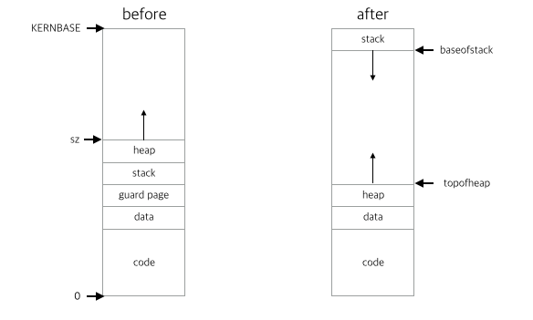

# Light-weight Process - Second milestone


## 1. Interaction with system calls in xv6

### 1.1 Exit

#### 1.1.1 Work flow

1. close all the file descriptions which LWPs used.

   > Before, `exit` just close one PCBs' fd, but with thread, exit should close several PCB's fd. So I made `cleanup_fs` which get PCB and clean up its fds.

2. find all the Childs of LWPs and make their parent to `initproc` and wakeup `initproc`.

   >`cleanup_child` function will do this work and also make LWP `ZOMBIE`.

3. Make all LWPs `ZOMBIE` and wakeup parent process where `wait` for main LWP.

   > First, we just make them `ZOMBIE` and resources will clean up in parent's `wait` function.

4. Enter scheduler (this make LWP never return because LWP is now `ZOMBIE`).

5. Parent process waked up (in `wait` function) and clean up all the resources which LWPs used.

   > Before, we just free one PCB in `wait`, but now we should also free PCBs of threads. We would do almost same clean up works as before, but we should not free `pgdir` because it should free only one time. So `wait` would have workflow like this.
   >
   > 1. find PCB which is 1. `ZOMBIE`, 2. child of process which call `wait`, 3. which is not made by `thread_create` (this checked `proc->threadof == 0`)
   > 2. find all of found PCB's thread(except main thread) and clean up(free) all the thread's resources except `pgdir`(address space).
   > 3. finally, cleanup main thread's resources and also `pgdir`.

Work flow except 4. Enter scheduler, we will use this for `exec` system call. So, I made `cleanup_all` function to gather this workflow.

---

### 1.2 Fork

#### 1.2.1 new address space design

Before explain `fork`, let me introduce new Address space design of xv6.



In original xv6, have 4kb stack and upside memory is allocated by `sbrk` system call which call `growproc` function. This design make problem when we make thread and call `sbrk` (may in `malloc` function). This will mix stack and heap area, so make hard to free memory and also make fragmentation after free.

I change this to new design which we learn in class, like general address space. Under the `KERNBASE` there is stack area which can grow downward (actually stack will start one `PGSIZE` below `KERNBASE` to not make error in `allocuvm`). Heap will grow upward after data area. This design distinguish stack and heap area. Make easy to free and reduce fragmentation problem. We need two new properties for this design.

```c
struct proc {
  uint topofheap;	// Top of heap area
  uint baseofstack;	// Base of stack area
}
```


Let's get back to `Fork`.

To make `fork` work, we should change several things to accustom this design.

1. Before, `copyuvm` just copy bottom of address space to `sz`. Now, we should copy bottom to `topofheap` and also stack area.
2. Should copy two new property of PCB, `topofheap` and `baseofstack`.
3. May `thread_exit` should work like `exit` in forked process, but I do this works in Milestone1. (in `thread_exit` it would call `exit` in main thread after wait all of it's thread, but in this case there is no other thread, so it will just call `exit`)


#### 1.2.2 solution

1. To solve first problem, I change `copyuvm` function to copy two distinguished area. Get 3 argument, `pgdir`, `topofheap`, and `baseofstack` to know where to copy. Inside `copyuvm`, copy two area.
2. Copy two properties to new PCB.
3. There is nothing to change, it will work as normal fork.

---

### 1.3 Exec

#### 1. Basic behavior:

>  When `exec` is called, all the related LWPs are terminated and one LWP (which call `exec`) will execute.

#### 2. Differences in exec system call 

1. We changed address space design, so we should allocate stack to downside of `KERNBASE`. 

   > we also set `topofheap` and `baseofstack` while fill memory to execute new program. `topofheap` will point to end of code&data area and `baseofstack` will point to bottom of guard page under stack.

2. We should terminate another LWPs.

   > use routine which we used in `exit`. We could use this because, actually in `exec`, it make new pgdir and interchange it to old one. So, chage pgdir of LWP which call `exec` and terminate all the LWPs which use `oldpgdir` (by call `cleanup_all(oldpgdir)`). This will make `exec` work fine in threaded process environment.

---

### 1.4 Sbrk

#### 1. Differences in sbrk system call

we changed address space design and also `topofheap` will point downside memory allocated area (which include code, data and heap). So, we should change `sbrk` to accustom it.

1. `sbrk` return start address of allocated area, so doesn't use `sz` anymore, instead we use `topofheap` so we return `topofheap`.
2. `sbrk` call `growproc` which alloc upside of `sz`. We also have to change `sz` to `topofheap` to manage new design.

Actually, we don't have to change basic `sbrk`'s behavior. We can just make seperate area for stack and heap, so they would not intermixed and this make easy to manage heap area with several stacks.

---

### 1.5 Kill

This is the easiest one. `Kill` just use `exit` in `trap`. We already change `exit` to work well in threaded environment. So it's done.

---

### 1.6 Pipe

when we call `fork` or `thread_create`, they copy file descriptors to new PCB. We use `filedup` function to copy it, but actually that function just return same pointer, so forked process or PWDs use same file descriptors as others. This make processes and threads share file descriptors, so we don't have to change anything to work pipe. It just works fine.

---

### 1.7 Sleep

We use same PCB to thread and sleep function is working fine with PCB (struct proc) and scheduler, so we don't have to change anything.

---

### 1.8 thread create thread(corner case)

I expained this in **milestone 1:** "1.3.2 `returnto`". 

If thread call `thread_create` then new thread is same as thread, share address space, new PCB, new userstack, start at start_routine, but it should remember which thread will call `thread_join` to wait for it. So I add `returnto` property in proc structure to remember which thread to wakeup.

---


## 2. Interaction with the schedulers (mlfq + stride)

My scheduler is working as several stride process which each has mlfq, so it's really easy to interaction with threads. Also, I make all the system calls (like exit wait sleep fork, etc) work as fine in each mlfq in several strides, so it is much easier to implement. There is one thing to modify.

1. Change `set_cpu_share` to move LWPs to new created stride control block.

   > when LWP call `set_cpu_share`, then find pcb which has same `pgdir` with LWP, then put it to `pptable` of stride control block. This will make LWPs run like mlfq inside proportional stride proc.
   >
   > This is explained in Project 2 final document.

**CAUTION**: stridetest1 would not work as we want.

stridetest1 will not present proper number what we want, because main thread which call `thread_create` is assigned to stride proc before calling `thread_create`. This is big problem because this affect to speed to execute `thread_create`, so process which assigned to 10% will be delayed to create threads. And process will start sleep lately, so it will run in different time.