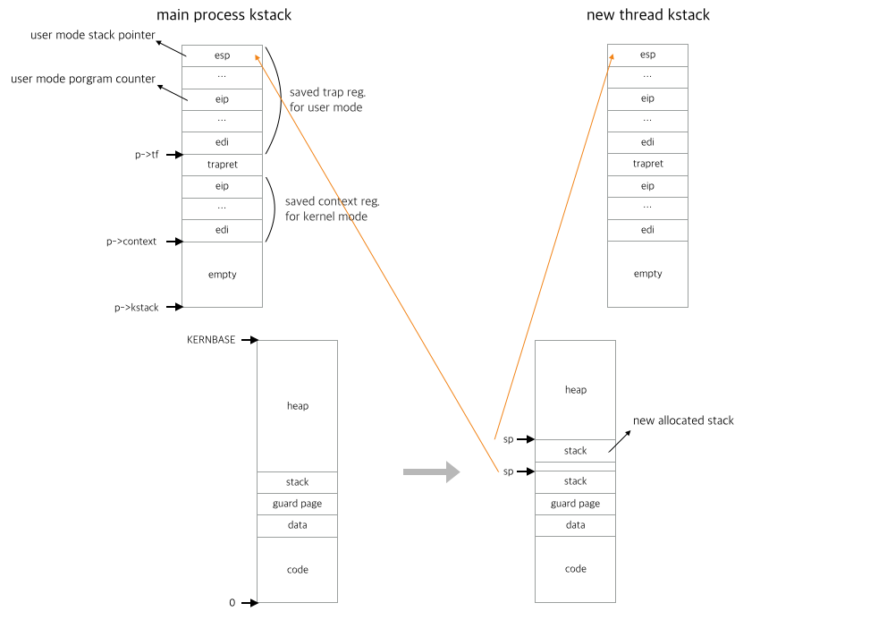
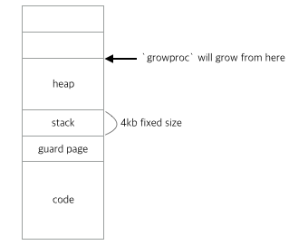

# Light-weight Process - First milestone

### Figure 1




## 1. thread_create

### 1.1 There are two important specs for LWP.

1. Share address space.

   > Light-weight processes use same page table (`pgdir` in `proc` structure). So, LWP can share  program code, static data, heap, also can share pointer which point to somewhere in it's address space(e.g. other LWP's stack) because they share same page table, they point same address in physical memory.

2. Have separate stack for independent execution.

   > LWP have it's own kernel stack and user stack. LWP share address space, but they should execute separately, so they need separate kernel stack for trap, context switch, they need user stack to execute in user mode.


### 1.2 Actually, `thread_create` 's behavior is really similar to `fork`, except two differences above explained. 

1. `fork` make new Address space which is copied from parent, but `thread_create` will use just same Address space, so it doesn't need to copy.

2. `fork` just copied all the states of parent, like trap states and context states in `kstack` and also user stack has same stack values(there is just one difference,  `eap` which is return value of `fork` function.). This make child process start to run where parent call fork, but `thread_create` will make new stack in same address space. In detail, actually, `thread_create` also run in almost same state as main process, but there are several differences.

   > 1. New thread will execute routine (function pointer) which is argument of `thread_create`. In trap frame(which saved in `kstack`), there is `eip` which is program counter in user mode. If we change `eip` to function pointer(just pointer to code of memory), then new thread will start to execute at that PC.
   > 2. New thread use same address space with main process(also other threads), so it can't use same stack pointer with them. We need to allocate new stack area for new thread like [Figure 1](###figure-1). We also have to put argument ( `void * arg`, third argument of `thread_create`) and return address (in this case we have to put fake address 0xffffffff, because thread will never return) like procedure call stack. In trap frame, there is `esp` which is stack pointer in user mode. We know new stack's pointer, so save it in `esp`.

   After set like this, we are ready to context switch to new thread and return-to-trap. New thread will start to run function with argument.

   ​

### 1.3 New properties for proc structure (PCB)

```c
struct proc {
  // save main process(which is made by fork)
  struct proc *threadof;	
  
  // save thread to return(where `thread_join()` execute for this thread)
  struct proc *returnto;	
  
  // save return value(or pointer)
  uint threadret;
  
  /* change usage when thread PCB */
  uint sz;	// point to top of it's stack
  int pid;	// thread id
}
```

1. `threadof`

   > This property will save main process(main thread). Main process's `threadof` will set to `0`
   >
   > This property mainly use to distinguish main process and threads. In my design, thread's pid has it's thread id, so `threadof` property can present where it came from. Also, main process has real `sz` of `pgdir` so we use this when thread call `thread_create` and allocate new stack for new thread.

2. `returnto`

   > This property will save thread to return.
   >
   > We usually call `thread_create` and `thread_join` in main process, but we could, also, call this functions in thread. If our thread call `thread_exit`, thread should wake up thread where it's join will call. We will use this property to do so.

3. `threadret`

   > This property will save return value temporary. 
   >
   > When thread call `thread_exit`, save retern value(or pointer of return value). And after that, when main process or other thread call `thread_join` for this thread, it will get retern value by `thread_join`'s argument.

4. `sz`

   > Before, this propery point to top of the user memory area. 
   >
   > But in my design, thread's `sz` will point to top address of it's stack. This will use when free stack area when thread exit, join. 
   >
   > BUT, here is big problems.
   >
   > before expain this, Let's look at xv6's memory allocation strategy.

   *** XV6's Memory allocation strategy with current problem***

   > It is similar that xv6 save code at the first address of memory, but it's stack and heap is allocated differently what we learn in class. like below
   >
   > 
   >
   > There is fixed size (4kb) of stack above code, and heap area will allocate above stack area when we first call `malloc`. We will call `growproc` to allocate new stack for new thread, then stack will allocate upside of heap. Then this will make problem, because stack's are allocated sparsely, and we should not free heap, beside there is no data in heap. If we just free stack, this will make fragment problem. So I will change strategy to allocate heap in **Milestone2**. Now my code will make error if program use `malloc` because it act like there is no heap area between stacks.

5. `pid`

   > In thread's PCB, `pid` will save it's thread id.
   >
   > Thread will save it's main process in `threadof`, so we can change `getpid` system call code to get `proc->threadof->pid` if it is thread.


### 1.4 Work flow

1. Allocate new thread's PCB by `allocproc` function.

   > Inside `allocproc`, it will allocate new `kstack` for new thread, initial setting for scheduler, and initial setting in kstack(make room for trap frame and context). And also will make pid(In my case, use this pid to thread id)

2. Save `pid` to `thread` return argument.

3. Save `threadof` and `returnto` in new thread's PCB.

4. Allocate new stack(for usermode) for new thread

5. Setting function call stack for new thread.

6. Initial new thread's PCB

7. Setting `esp` and `eip` for function call

8. Make thread `RUNNABLE` to run by scheduler.


## 2. thread_exit

### 2.1 There are two case where `thread_exit` will call.

1. call at main process which is made by `fork`

   > In this case, main process will wait for all the threads it create, it will call `exit` after that.

2. call at threads which are made by `thread_create`

   > In this case, 
   >
   > 1. Thread's file i/o will be cleaned up and thread's child's parent will change to `initproc` 
   > 2. Wakeup it's `returnto` where `thread_join` is waiting for. 
   > 3. PCB will save return value (`thread_exit`'s argument). 
   > 4. Thread's state turn to `ZOMBIE` and go into scheduler, so `thread_exit` will never return.


## 3. thread_join

### 3.1 `thread_join` is similar to `wait`.

Two system call behave similar, but there are differences.

1. `wait` wait for all of it's child to exit(), but `thread_join` just wait for specific thread which get from argument.
2. `wait` free it's `pgdir` (address space), but `thread_join` should not free it because it's address space is shared with other thread and main process.
3. `thread_join` should free thread's user stack which allocate in shared address space.


### 3.2 Work flow

1. Find thread from `ptable` which has same thread id with argument.
2. Check found thread is `ZOMBIE`.
3. If not, then sleep before thread wakeup it at `thread_exit`.
4. If process waked up and check that thread is `ZOMBIE`
5. Save return value to argument pointer
6. Free user stack and kstack.
7. Set initial values to PCB.

